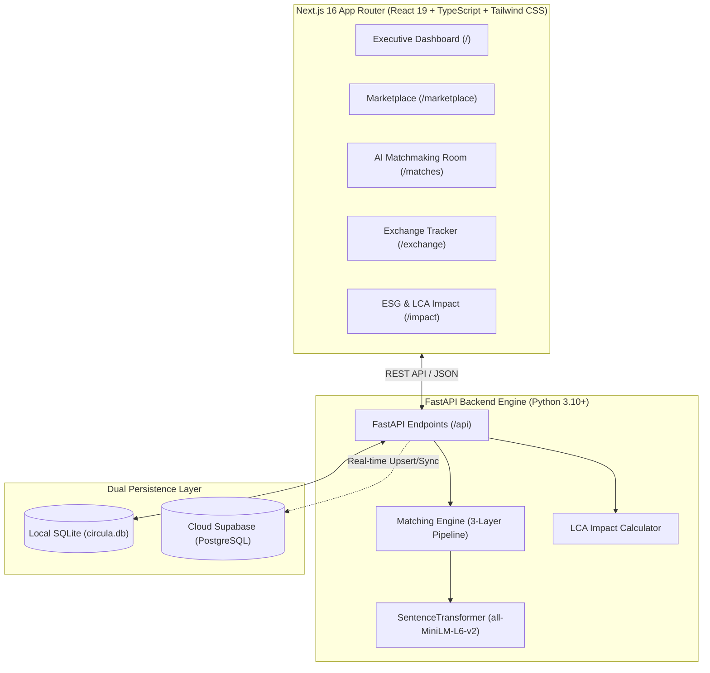

# ♻️ Circula — AI-Powered B2B Industrial Circular Marketplace

[](https://fastapi.tiangolo.com)
[](https://nextjs.org/)
[](https://react.dev/)
[](https://www.typescriptlang.org/)
[](https://supabase.com)
[](https://huggingface.co/sentence-transformers/all-MiniLM-L6-v2)
[](https://opensource.org/licenses/MIT)

**Circula** is an enterprise B2B circular economy matchmaking platform that connects industrial waste and surplus resource producers with manufacturers seeking secondary raw materials. By combining deep semantic AI vector embeddings, geographic distance filtering, and multi-factor weighted ranking, Circula closes industrial loops, reduces landfill disposal costs, and quantifies real-time ESG metrics ($CO_2e$ avoided, water saved, and waste diverted).

---

## 📌 Table of Contents

- [Core Value Proposition](#-core-value-proposition)
- [System Architecture](#-system-architecture)
- [AI Matchmaking Pipeline](#-ai-matchmaking-pipeline)
- [ESG & Environmental Impact Science](#-esg--environmental-impact-science)
- [Project Structure](#-project-structure)
- [Tech Stack](#-tech-stack)
- [Getting Started](#-getting-started)
  - [Prerequisites](#prerequisites)
  - [Installation](#installation)
  - [Environment Configuration](#environment-configuration)
  - [Database Setup & Seeding](#database-setup--seeding)
  - [Running the Application](#running-the-application)
- [Root Commands Reference](#-root-commands-reference)
- [API Reference](#-api-reference)
- [Frontend Pages & Features](#-frontend-pages--features)
- [Contributing](#-contributing)
- [License](#-license)

---

## 💡 Core Value Proposition

Industrial facilities frequently pay heavy disposal fees for recyclable scrap while neighboring manufacturers import virgin materials at inflated costs and high carbon footprints.

**Circula solves this by:**
1. **Semantic Resource Mapping**: Automatically recognizing material equivalence (e.g. mapping *"copper wire scrap"* to *"Cu alloy scrap"*) using SentenceTransformer embeddings (`all-MiniLM-L6-v2`).
2. **Hyperlocal Optimization**: Balancing freight costs and transit emissions via Haversine distance computations (<= 200 km threshold).
3. **Automated Match Scoring**: Providing real-time 0–100% match scores with granular factor breakdowns.
4. **Verifiable ESG Accounting**: Translating circular transactions into avoided greenhouse gas emissions ($CO_2e$), conserved freshwater, and diverted landfill volume based on peer-reviewed Life Cycle Assessment (LCA) data.
5. **Dual Persistence Layer**: Seamless offline-resilient local SQLite caching synchronized with cloud Supabase (PostgreSQL).

---

## 🏗 System Architecture



---

## 🧠 AI Matchmaking Pipeline

The recommendation engine uses a **3-layer hybrid matchmaking pipeline**:

```
 ┌────────────────────────────────────────────────────────┐
 │ Layer 1: Rule-Based Hard Filtering                    │
 │ • Zero/Negative quantity exclusion                    │
 │ • Maximum delivery radius threshold (<= 200 km)        │
 │ • Location & Coordinate integrity check               │
 └──────────────────────────┬─────────────────────────────┘
                            ▼
 ┌────────────────────────────────────────────────────────┐
 │ Layer 2: Semantic AI Vector Similarity                │
 │ • SentenceTransformer (`all-MiniLM-L6-v2`) embeddings │
 │ • Precomputed 384-dimensional vector embeddings        │
 │ • Cosine similarity calculation + synonym fallback     │
 └──────────────────────────┬─────────────────────────────┘
                            ▼
 ┌────────────────────────────────────────────────────────┐
 │ Layer 3: Multi-Factor Weighted Scoring                 │
 │ • Material Compatibility:  40%                         │
 │ • Geographic Proximity:    25%                         │
 │ • Quantity Compatibility:  20%                         │
 │ • Quality Grade Match:     10%                         │
 │ • Availability / Timeline:  5%                         │
 └──────────────────────────┬─────────────────────────────┘
                            ▼
           Final Circula Match Score (0 - 100%)
```

### Mathematical Scoring Formulation:

$$\text{MatchScore} = \left(0.40 \cdot S_{\text{material}} + 0.25 \cdot S_{\text{geo}} + 0.20 \cdot S_{\text{qty}} + 0.10 \cdot S_{\text{quality}} + 0.05 \cdot S_{\text{avail}}\right) \times 100$$

Where:
- **$S_{\text{material}}$**: Cosine similarity between embedding vectors $\vec{v}_{\text{resource}}$ and $\vec{v}_{\text{requirement}}$.
- **$S_{\text{geo}}$**: Linear decay over distance: $\max\left(0, 1 - \frac{\text{Distance (km)}}{200}\right)$.
- **$S_{\text{qty}}$**: Fulfilment ratio: $\min\left(1.0, \frac{\text{Quantity}_{\text{resource}}}{\text{Quantity}_{\text{requirement}}}\right)$.
- **$S_{\text{quality}}$**: Exact grade match ($1.0$), partial overlap ($0.85$), or fallback ($0.50$).
- **$S_{\text{avail}}$**: Immediate availability ($1.0$) vs scheduled ($0.75$).

---

## 🌿 ESG & Environmental Impact Science

Circula calculates real-time avoided emissions and resource conservation metrics using verified LCA benchmarks:

| Material | Avoided $CO_2e$ Factor | Avoided Water Factor | Avoided Disposal Fee | Authoritative Standard / Source |
| :--- | :--- | :--- | :--- | :--- |
| **Aluminium** | $10.50\text{ kg } CO_2e/\text{kg}$ | $14.0\text{ L/kg}$ | ₹$18.00/\text{kg}$ | International Aluminium Institute (IAI) 2021 |
| **Copper** | $3.10\text{ kg } CO_2e/\text{kg}$ | $130.0\text{ L/kg}$ | ₹$25.00/\text{kg}$ | International Copper Association (ICA) 2022 / Northey et al. |
| **Steel / Iron** | $1.50\text{ kg } CO_2e/\text{kg}$ | $28.0\text{ L/kg}$ | ₹$12.00/\text{kg}$ | World Steel Association 2023 |
| **Plastics (HDPE/PP/PET)** | $1.53\text{ kg } CO_2e/\text{kg}$ | $8.0\text{ L/kg}$ | ₹$20.00/\text{kg}$ | UK DEFRA Conversion Factors 2023 / ICIS |
| **Paper / Cardboard** | $0.84\text{ kg } CO_2e/\text{kg}$ | $10.0\text{ L/kg}$ | ₹$8.00/\text{kg}$ | US EPA WARM Model v15 2020 |

---

## 📁 Project Structure

```text
.
├── backend/                             # FastAPI Backend Service
│   ├── routers/
│   │   ├── __init__.py
│   │   └── matches.py                  # Match listing and generation router
│   ├── services/
│   │   ├── __init__.py
│   │   ├── matching_engine.py           # AI sentence transformer & hybrid scoring engine
│   │   └── impact_calculator.py         # Environmental impact & LCA calculator
│   ├── scripts/
│   │   ├── seed_supabase.py            # Supabase seeder
│   │   └── sync_sqlite_to_supabase.py   # SQLite to Supabase migration utility
│   ├── database.py                      # SQLAlchemy engine and SQLite session maker
│   ├── models.py                        # SQLAlchemy ORM definitions
│   ├── schemas.py                       # Pydantic schemas for request/response validation
│   ├── supabase_client.py               # Supabase cloud database client
│   ├── seed.py                          # Initial database seeding script
│   ├── main.py                          # FastAPI application entrypoint
│   └── requirements.txt                 # Python dependencies
├── frontend/                            # Next.js 16 App Router Frontend
│   ├── src/
│   │   ├── app/
│   │   │   ├── exchange/                # Circular exchange execution & deal tracking
│   │   │   ├── impact/                  # ESG & Carbon Impact Analytics dashboard
│   │   │   ├── marketplace/             # Surplus materials & listings catalog
│   │   │   ├── matches/                 # AI Matches recommendation screen
│   │   │   ├── globals.css              # Global styles & theme definitions
│   │   │   ├── layout.tsx               # Root layout and theme shell
│   │   │   └── page.tsx                 # Main executive overview dashboard
│   │   ├── components/                  # Reusable UI components & modals
│   │   │   ├── AddResourceModal.tsx
│   │   │   ├── PostRequirementModal.tsx
│   │   │   ├── AddMultipleCompaniesModal.tsx
│   │   │   ├── ImpactChart.tsx
│   │   │   ├── Providers.tsx
│   │   │   └── layout/Navbar.tsx
│   │   └── lib/                         # Supabase client, API helper, Context providers
│   ├── package.json
│   ├── tsconfig.json
│   └── tailwind.config.ts
├── supabase_schema.sql                  # Supabase PostgreSQL schema definition
├── package.json                         # Monorepo root command orchestrator
└── README.md                            # Complete documentation
```

---

## 💻 Tech Stack

### Frontend:
- **Framework**: [Next.js 16](https://nextjs.org/) (App Router, Server & Client Components)
- **Library**: [React 19](https://react.dev/)
- **Language**: TypeScript 5
- **Styling**: Tailwind CSS & Vanilla CSS Design Tokens
- **Icons**: Lucide React
- **Visualizations**: Recharts
- **Data Fetching**: Native Fetch + Supabase JS Client

### Backend & AI:
- **Framework**: [FastAPI](https://fastapi.tiangolo.com/) (ASGI, High-Performance Async)
- **ORM / Persistence**: SQLAlchemy + SQLite (`circula.db`)
- **Cloud Database**: [Supabase](https://supabase.com/) (PostgreSQL)
- **NLP / Semantic Matching**: [SentenceTransformers](https://www.sbert.net/) (`all-MiniLM-L6-v2`)
- **Vector Math**: Scikit-Learn (Cosine Similarity) & Haversine Geodesic Math

---

## 🚀 Getting Started

### Prerequisites
- **Node.js**: `v18.17+` or `v20+`
- **Python**: `3.10+` or `3.11+`
- **Git**

---

### Installation

1. **Clone the repository:**
   ```bash
   git clone https://github.com/THICHANAMOORTHY/b2b.git
   cd b2b
   ```

2. **Set up Python Virtual Environment (Backend):**
   ```bash
   cd backend
   python -m venv venv
   
   # Windows:
   .\venv\Scripts\activate
   # macOS/Linux:
   source venv/bin/activate
   
   pip install -r requirements.txt
   cd ..
   ```

3. **Install Frontend Dependencies:**
   ```bash
   cd frontend
   npm install
   cd ..
   ```

---

### Environment Configuration

1. **Backend Environment (`backend/.env`):**
   ```env
   SUPABASE_URL=https://your-supabase-id.supabase.co
   SUPABASE_KEY=your-supabase-service-or-anon-key
   ```

2. **Frontend Environment (`frontend/.env.local`):**
   ```env
   NEXT_PUBLIC_SUPABASE_URL=https://your-supabase-id.supabase.co
   NEXT_PUBLIC_SUPABASE_ANON_KEY=your-supabase-anon-key
   NEXT_PUBLIC_API_URL=http://localhost:8000/api
   ```

---

### Database Setup & Seeding

1. **Initialize Local Database & Seed Sample Data:**
   ```bash
   npm run seed
   ```

2. **Generate AI Compatibility Matches:**
   ```bash
   npm run match
   ```

3. *(Optional)* **Sync SQLite Data to Cloud Supabase:**
   ```bash
   # Run supabase_schema.sql in your Supabase SQL editor first, then run:
   npm run sync:supabase
   ```

---

### Running the Application

You can launch both the frontend and backend concurrently with a single command from the project root:

```bash
npm run dev:all
```

- **Backend API**: [http://localhost:8000](http://localhost:8000)
- **Interactive Swagger Docs**: [http://localhost:8000/docs](http://localhost:8000/docs)
- **Frontend App**: [http://localhost:3000](http://localhost:3000)

---

## ⚡ Root Commands Reference

The root `package.json` provides unified commands across the full stack:

| Command | Description |
| :--- | :--- |
| `npm run dev:all` | Concurrently runs both FastAPI backend (`:8000`) and Next.js frontend (`:3000`) |
| `npm run dev` | Starts the Next.js development server |
| `npm run api` | Starts the FastAPI Uvicorn backend server with auto-reload |
| `npm run seed` | Populates local SQLite database with sample industrial companies & materials |
| `npm run match` | Triggers the AI matching engine endpoint to evaluate compatibility pairs |
| `npm run sync:supabase` | Synchronizes local SQLite tables to your remote Supabase PostgreSQL instance |
| `npm run build` | Builds the Next.js production bundle |
| `npm run lint` | Runs ESLint checks across the frontend codebase |

---

## 📡 API Reference

| Method | Endpoint | Description |
| :--- | :--- | :--- |
| `GET` | `/api/health` | Service health status check |
| `GET` | `/api/companies` | List all registered industrial companies |
| `POST` | `/api/companies` | Register a new company |
| `POST` | `/api/companies/bulk` | Bulk import company entities |
| `GET` | `/api/resources` | List all available waste / surplus material listings |
| `POST` | `/api/resources` | Create a new surplus resource listing |
| `DELETE` | `/api/resources/{id}` | Delete a resource listing |
| `GET` | `/api/requirements` | List all industrial procurement requirements |
| `POST` | `/api/requirements` | Post a new secondary material requirement |
| `DELETE` | `/api/requirements/{id}`| Delete a requirement |
| `GET` | `/api/matches` | Get all generated matches with score breakdowns |
| `POST` | `/api/generate-matches` | Trigger the 3-layer AI matchmaking engine |
| `GET` | `/api/impact` | Aggregate real-time ESG metrics ($CO_2e$, water, waste, cost) |
| `GET` | `/api/emission-factors` | Reference lookup table with research citations |

---

## 🖥️ Frontend Pages & Features

1. **Executive Dashboard (`/`)**:
   - High-level circular metrics, ESG summary cards, and KPI statistics.
   - Quick resource listing and requirement submission modals.
   - Live company switcher to simulate multi-tenant industrial interactions.

2. **Marketplace Catalog (`/marketplace`)**:
   - Filterable catalog of industrial surplus, by-products, and scrap materials.
   - Location, quantity, price, and quality grade filters.

3. **AI Matches Room (`/matches`)**:
   - Real-time match feed sorted by compatibility score.
   - Visual breakdown of material affinity, distance radius, and quantity ratio.
   - One-click initiation of circular exchanges.

4. **Exchange Tracker (`/exchange`)**:
   - Status pipeline for circular transactions (*Initiated*, *In Transit*, *Completed*).
   - Instant updating of environmental impact upon deal completion.

5. **ESG Impact & Analytics (`/impact`)**:
   - Dynamic charts visualizing carbon reduction trends, water conservation, and waste diversion.
   - Fully cited research methodology for hackathon judges and sustainability auditors.

---

## 🤝 Contributing

Contributions, issues, and feature requests are welcome!
Feel free to check the [issues page](https://github.com/THICHANAMOORTHY/b2b/issues).

1. Fork the Project
2. Create your Feature Branch (`git checkout -b feature/AmazingFeature`)
3. Commit your Changes (`git commit -m 'Add some AmazingFeature'`)
4. Push to the Branch (`git push origin feature/AmazingFeature`)
5. Open a Pull Request

---

## 📄 License

Distributed under the **MIT License**. See `LICENSE` for more information.
